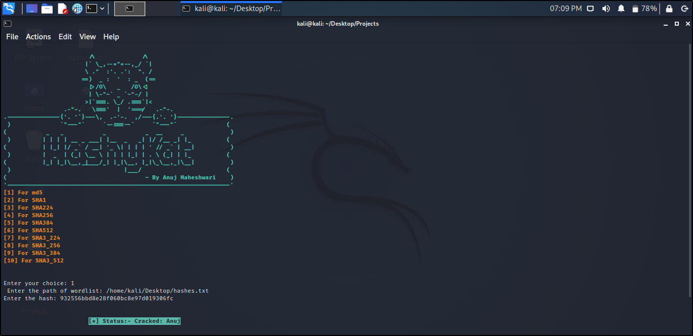

<h1 align="center"> HashyKat </h1>




## Hash & Hashing
A hash is a mathematical operation that transforms an input of any length into an encrypted output of a specific length. Hashing is a cryptographic process that can be used to validate the authenticity and integrity of various types of input. It is extensively used in authentication systems to prevent keeping plaintext passwords in databases, but it is also used to authenticate files, documents, and other sorts of data. <br>
<b> " HashyKat " </b> is one such python tool which aims to crack hashes of different types like md5, sha1, sha224, sha256, sha384, sha512, sha3_224, sha3_256, sha3_384 and 
sha3_512.


## Features
- [x] Fast
- [x] Multi-Thread
- [x] Convenient use
- [x] Crack 100%

```
- md5
- sha1
- sha224
- sha256 
- sha384
- sha512
- SHA3_224
- SHA3_256
- SHA3_384
- SHA3_512
