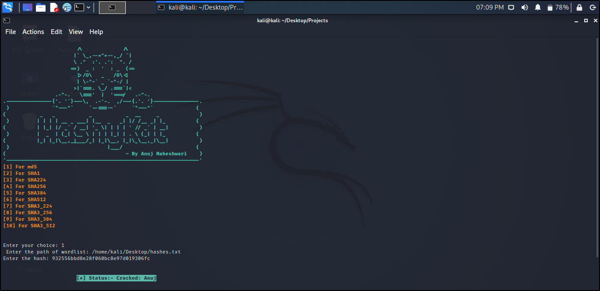

<h1 align="center"> HashyKat </h1>

# Types of Hashes
<h4> md5 </h4>
<h4> SHA1 </h4>
<h4> SHA224 </h4>
<h4> SHA256 </h4>
<h4> SHA384 </h4> 
<h4> SHA512 </h4> 
<h4> SHA3_224 </h4>
<h4> SHA3_256 </h4>
<h4> SHA3_384 </h4> 
<h4> SHA3_512 </h4> 
